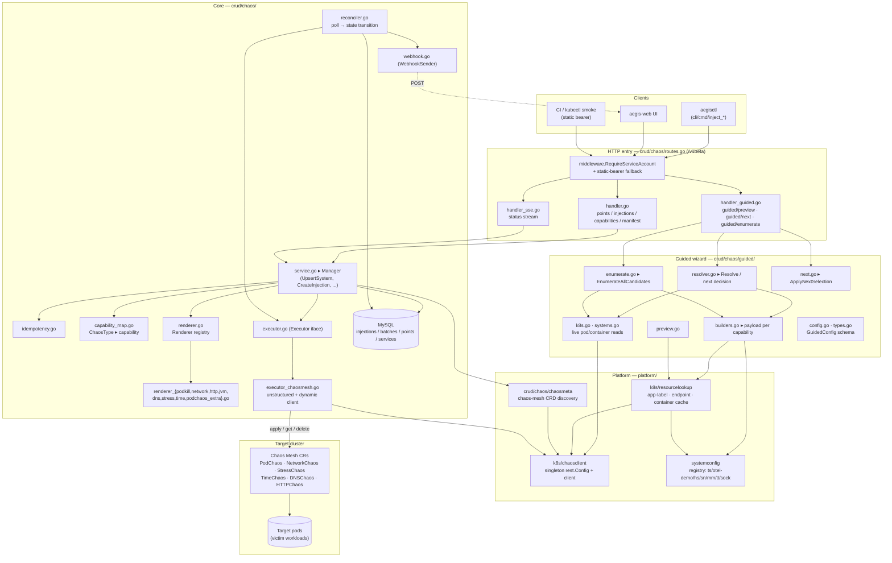
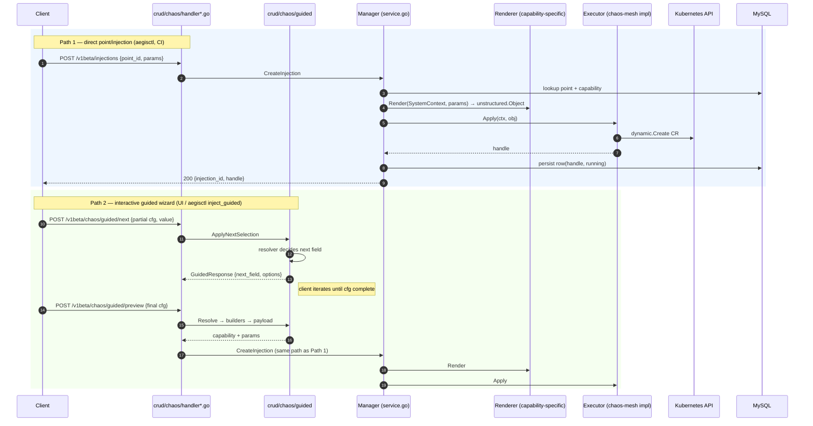
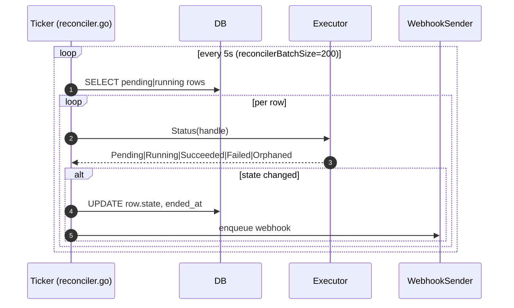

# Fault-Injection Architecture (post-refactor, 2026-05-21)

State after PRs #441–#446. `aegislab/src/internal/chaosengine/` no longer
exists; all components live under the canonical four-bucket layout
(`core / crud / platform / cli`).

## Top-level flow

## Two write paths into `Executor.Apply`

## Background reconcile loop

## Component map (post-refactor)

| Layer | Package | Responsibility |
|---|---|---|
| HTTP | `crud/chaos/handler.go` | Singleton & batch injection routes |
| HTTP | `crud/chaos/handler_guided.go` | Guided wizard routes (DTO round-trip into `crud/chaos/guided`) |
| HTTP | `crud/chaos/handler_sse.go` | Status streaming |
| Service | `crud/chaos/service.go` (`Manager`) | Orchestrates DB + renderer + executor |
| Service | `crud/chaos/reconciler.go` | Background CR status polling |
| Service | `crud/chaos/webhook.go` | Outbound state notifications |
| Capability dispatch | `crud/chaos/capability_map.go` | `ChaosType` ⇄ capability name |
| Render | `crud/chaos/renderer.go` + `renderer_*.go` | Capability → unstructured Chaos-Mesh CR |
| Execute | `crud/chaos/executor.go` (iface), `executor_chaosmesh.go` | Apply / Status / Destroy via dynamic client |
| Guided UX | `crud/chaos/guided/` | Decision tree + payload builders + live-cluster reads |
| Metadata | `crud/chaos/chaosmeta/` | Discover installed Chaos-Mesh CRDs |
| Platform | `platform/k8s/chaosclient` | Singleton `*rest.Config` + clients (boot-time init) |
| Platform | `platform/k8s/resourcelookup` | App-label / HTTP-endpoint / container caches |
| Platform | `platform/systemconfig` | System registry (`ts`, `otel-demo`, `hs`, `sn`, `mm`, `tt`, `sock`) + current `AppLabelKey` |

## Boundary contracts

- **`crud/chaos` → Chaos-Mesh CRDs** is the only k8s write path. Every CR
  is produced by exactly one `Renderer`; `executor_chaosmesh.go` applies
  it through one dynamic client. No other package writes Chaos-Mesh CRs.
- **`crud/chaos/guided` does NOT call `Executor`.** It only resolves
  configs into `(capability, params)` and hands back to the handler,
  which then walks the same Path 1 above. This is why both paths share
  Render + Apply.
- **All kube reads go through `platform/k8s/chaosclient`'s cached
  config** since PR #446. `guided/k8s.go` and `guided/systems.go` both
  call `chaosclient.GetK8sConfig()`; there is no second kubeconfig
  discovery anywhere in the chaos stack.
- **`platform/systemconfig` is the single source of truth for system
  identity.** `SystemType` strings (`ts`, `hs`, …) are minted here;
  `renderer_*.go` resolves `AppLabelKey` from it via `SystemContext`.

## Where chaos points come from

Capabilities are emitted by `tools/capgen/` into
`tools/capgen/output/capabilities.json`. `capability_map.go` is the
hand-maintained Go projection of the same identity. Adding a new
capability requires (a) a capgen entry, (b) a `Renderer` registration,
and (c) the capability_map row — the executor/service plumbing is
generic.
