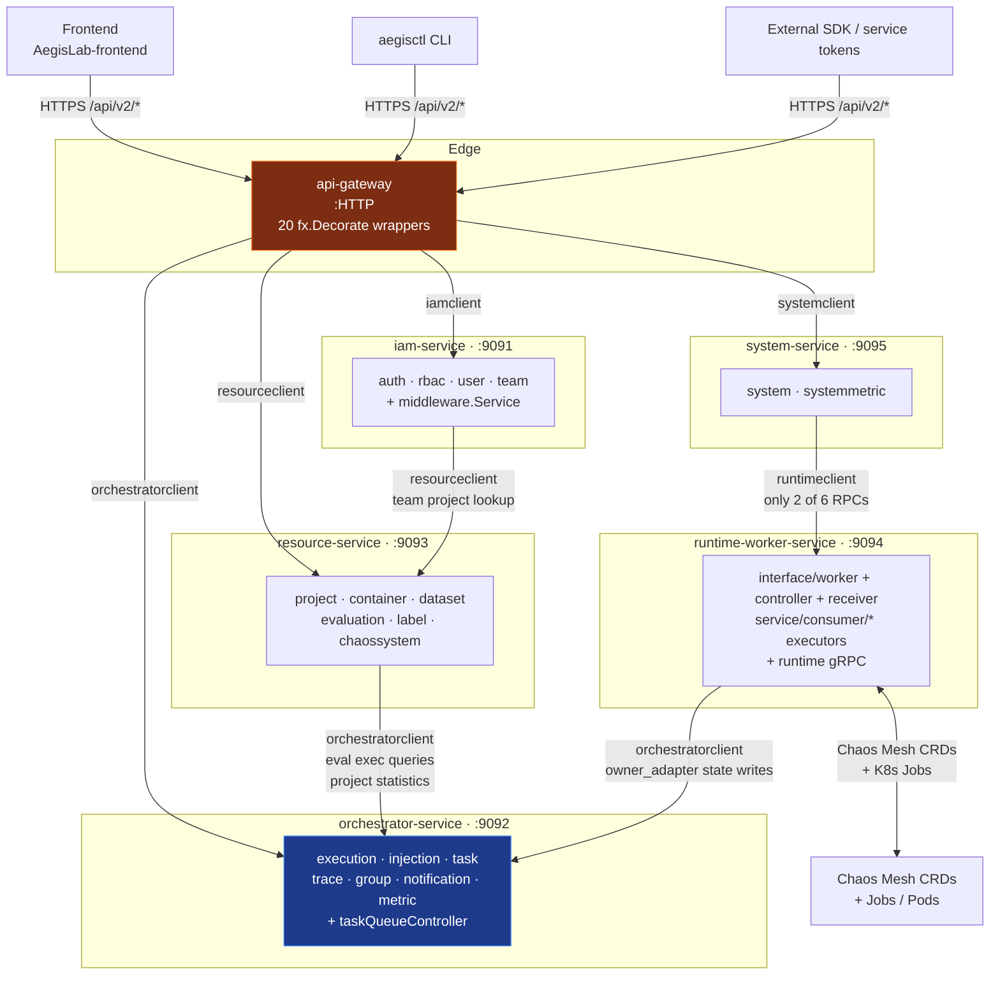
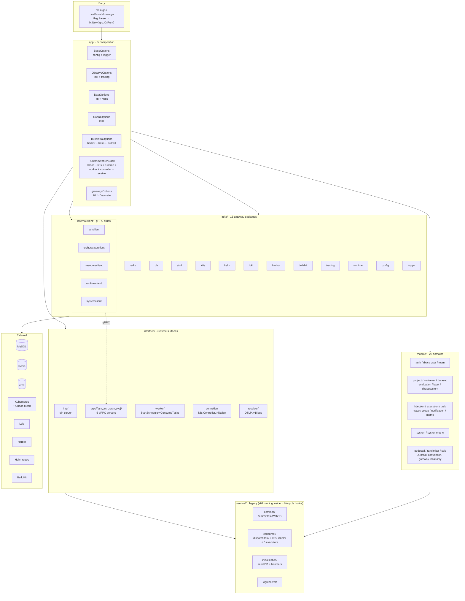
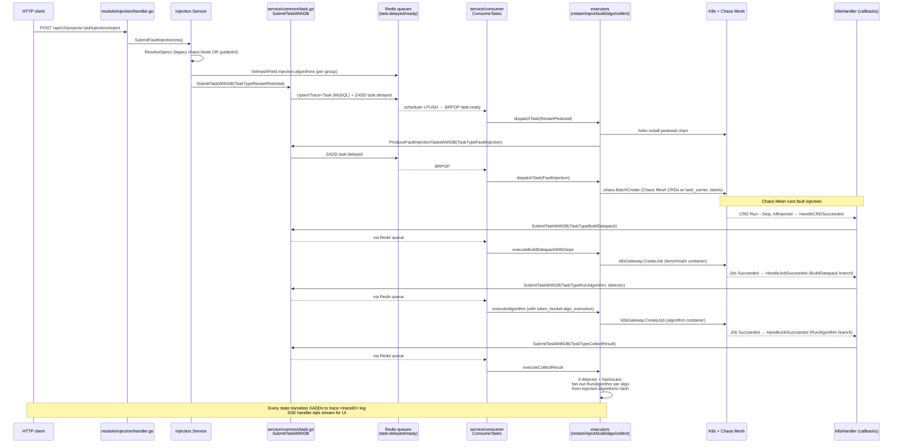

# AegisLab Code Topology — v2 (Post-Refactor)

Source-of-truth: code under `/home/ddq/AoyangSpace/aegis/AegisLab/src/` as of 2026-04-19
(AegisLab submodule commit `42282d0c` — *refactor aegislab (#71)*).
Docs were deliberately ignored — every claim cites `file.go:line`.

> **Important**: This replaces the earlier v1 recovery. The refactor renamed, split, and
> reorganized almost every layer (flat monolith → fx-based DI with 6 microservices +
> 3 legacy modes). If a claim in older docs (including CLAUDE.md) conflicts with what's
> here, trust this recovery.

## 📁 Documents

- **`README.md`** (this file) — overview, module map, 6-service dependency graph.
- **[`flows.md`](flows.md)** — 7 critical call paths (inject→collect, HTTP lifecycle,
  task queue, rate-limiter GC, OTLP log tail, config hot-reload, SSE/WS streams).
- **[`reference.md`](reference.md)** — entities, Redis key catalog, K8s labels, task
  types, RBAC matrix, DTO↔entity map.
- **[`orphans.md`](orphans.md)** — dead code, stale whitelists, security red flags,
  correctness bugs, partial-migration signs.
- **[`slices/`](slices/)** — raw per-layer reports from the 7-agent map-reduce.
  These are authoritative for any file:line citation you need to re-verify.

## 1. The repos

`workspace.yaml` declares 4 submodules:

| Repo | Role | Stack | Relationship |
|---|---|---|---|
| `AegisLab/` | Backend — subject of this topology. Single Go module `aegis`, **443 `.go` files / ~71k LoC**. | Go + Python SDK | owns OpenAPI; writes datapack artifacts |
| `AegisLab-frontend/` | Web UI | TS/React + Vite + axios | calls `/api/v2/*` (flat, not audience-prefixed) + SSE/WS literals |
| `chaos-experiment/` | Fault-injection library (OperationsPAI fork; `go.mod:63` replace → local path) | Go | AegisLab imports only `handler`, `client`, `pkg/guidedcli` |
| `rcabench-platform/` | RCA eval platform | Python | reads datapack dir files (`trace/log/metrics/metrics_sli.parquet`, `injection.json`) AegisLab writes |

## 2. 9 run modes (what the `rcabench` binary can be)

`main.go` uses cobra+viper to dispatch; each mode ultimately calls `fx.New(<appOptions>).Run()`.
All 6 microservices also ship as their own `cmd/<name>-service/main.go` binaries (thin `flag.Parse` →
same `fx.New`).

| Mode | Options fn | Role |
|---|---|---|
| `producer` (legacy) | `app.ProducerOptions` (`app/producer.go:19`) | Monolith HTTP: all domain modules + HTTP lifecycle |
| `consumer` (legacy) | `app.ConsumerOptions` (`app/consumer.go:5`) | Monolith async workers: runtime-worker-stack + Exec/Inj owners |
| `both` (legacy; `make local-debug`) | `app.BothOptions` (`app/both.go:5`) | Producer HTTP + runtime-worker-stack, single process |
| `api-gateway` | `gateway.Options` (`app/gateway/options.go:36`) | HTTP edge + 20 `fx.Decorate` calls routing each HandlerService to a gRPC client |
| `iam-service` | `iam.Options` (`app/iam/options.go:17`) | modules: auth, rbac, team, user (+ middleware.Service + iam gRPC server) |
| `orchestrator-service` | `orchestrator.Options` (`app/orchestrator/options.go:16`) | modules: execution, injection, task, trace, group, metric, notification (+ orchestrator gRPC server) — **pure sink, no outbound deps** |
| `resource-service` | `resource.Options` (`app/resource/options.go:18`) | modules: project, container, dataset, evaluation, label, chaossystem (+ resource gRPC server) |
| `runtime-worker-service` | `runtimeapp.Options` (`app/runtime/options.go:11`) | runtime-worker-stack + `consumer.RemoteOwnerOptions()` forces orchestrator RPC for state writes |
| `system-service` | `system.Options` (`app/system/options.go:15`) | modules: system, systemmetric (+ system gRPC server + runtimeclient) |

See `slices/01-app-wiring.md` §3 for the full fx-composition table per mode.

## 3. Service dependency graph (gRPC)

Derived from `RequireConfiguredTargets` declarations + `fx.Decorate` client injections.
All inter-service traffic is plain TCP gRPC (no TLS). Clients are typed wrappers in
`internalclient/<svc>client/` that return `Enabled()==false` when the target address is
unset — at which point `remoteAware*` wrappers fall back to local `HandlerService` impls.



- `api-gateway` → `{iam, orchestrator, resource, system}` (all 4)
- `iam-service` → `resource-service` (team project lookups)
- `resource-service` → `orchestrator-service` (execution queries + project statistics)
- `runtime-worker-service` → `orchestrator-service` (state writes via `owner_adapter.go`)
- `system-service` → `runtime-worker-service` (runtime status — only 2 of 6 RPCs actually wrapped)
- `orchestrator-service` → ∅ (leaf; consumed by gateway/resource/runtime/system)

Port assignments: iam=9091, orch=9092, resource=9093, runtime=9094, system=9095.
Config keys follow `clients.<name>.target` with legacy fallback `<name>.grpc.target`;
`runtime-worker` also uses `runtime_worker.grpc.target` (naming drift — see `orphans.md §E9`).

## 4. The module convention

Every domain lives under `module/<name>/`. A "clean" module has:

| File | Role |
|---|---|
| `module.go` | `var Module = fx.Module("<name>", fx.Provide(...))` — wires all below |
| `api_types.go` | module-local DTOs (replaces the old top-level `dto/`) |
| `handler.go` | gin HTTP handlers (with `@Router`/`@Security` Swagger annotations) |
| `handler_service.go` | the `HandlerService` interface + `AsHandlerService(*Service)` adapter |
| `service.go` | local business-logic implementation |
| `repository.go` | GORM DAO |
| domain files | `*_store.go`, `resolve.go`, `submit.go`, `file_store.go`, `core.go`, etc. |

The `HandlerService` interface is the gateway decoration seam: in gateway mode, `fx.Decorate`
wraps the local impl with `remoteAwareXService{ HandlerService: local, grpc: remoteClient }`,
so either path presents the same interface to `handler.go` (see §5). Modules that **break**
this convention (`pedestal`, `sdk`, `ratelimiter`) can only run locally — they are never
decorated.

There are **22 `module/` packages** wired into `ProducerHTTPModules()` at
`app/http_modules.go:40-60`:

```
auth  chaossystem  container  dataset  evaluation  execution  group  injection
label  metric  notification  pedestal  project  ratelimiter  rbac  sdk
system  systemmetric  task  team  trace  user
```

(Plus `docs` which is declared but never routed.)

## 5. Gateway Decorator pattern

In gateway mode, `app/gateway/options.go:57-177` wraps 20 HandlerServices:

```
fx.Decorate(func(local injection.HandlerService, remote *orchestratorclient.Client) injection.HandlerService {
    return remoteAwareInjectionService{ HandlerService: local, orchestrator: remote }
})
```

Each wrapper in `app/gateway/*_services.go` either forwards to the gRPC client (when
`remote.Enabled()`), or returns `missingRemoteDependency(name)`. The full table is in
`slices/01-app-wiring.md` §5.

Notable: the gateway also decorates `middleware.Service` (built by `middleware.NewService`
inside `router.Module`) with `remoteAwareMiddlewareService`, forcing token verification + permission
checks to go through `iamclient.Client.VerifyToken`/`CheckPermission`. So the gateway can be a
pure auth proxy to `iam-service`.

## 6. Layered view of a single run

Every process — whether monolith `both` or one of the 6 microservices — composes the
same layers via fx. The per-mode `app.*Options()` picks which subset of modules gets
wired, but the layering is uniform.



**Reading this diagram**:

- `app/` is pure wiring — each mode composes a different subset of the lower layers.
- `module/` domains are the business-logic units. The gateway re-wires their HandlerServices to
  `internalclient/` stubs via `fx.Decorate`, so each module's handler still sees the same
  interface regardless of monolith-vs-split deployment.
- `interface/` packages own the runtime lifecycle hooks (HTTP server, gRPC servers, K8s
  informer goroutines, OTLP receiver). All replace the old `main.go` `go ...` boot calls.
- `service/` (legacy) is **not gone** — it's the async engine (`service/consumer/`) plus the
  canonical task submission (`service/common.SubmitTaskWithDB`) plus seeding. These are invoked
  from `interface/worker`'s fx OnStart hook, not from `main.go`.

## 7. Inbound-edge map (who calls whom)

| Target package | Called from |
|---|---|
| `app/*` | `main.go`, `cmd/*/main.go` (via fx) |
| `router/` | `interface/http/module.go` (consumes `router.Module`'s `NewHandlers`) |
| `middleware/` | `router/*.go` for every authed group; `handlers/` helpers |
| `interface/http/` | wired into `ProducerHTTPOptions` only |
| `interface/grpc/<svc>/` | wired per microservice in `app/<svc>/options.go` |
| `interface/worker/`, `/controller/`, `/receiver/` | wired into `RuntimeWorkerStackOptions` |
| `module/<name>/handler` | route registration in `router/{public,sdk,portal,admin}.go` |
| `module/<name>/service` | own handler; also called from sibling modules (e.g. `injection.Service` pulled by `consumer/k8s_handler` and `evaluation`) |
| `module/<name>/repository` | own service + rarely `initialization/` seeding |
| `service/common/task.SubmitTaskWithDB` | `module/injection/service.go:341,430`, `module/execution/service.go:124`, `service/consumer/k8s_handler.go:327,630,706`, `restart_pedestal.go` (via `ProduceFaultInjectionTasksWithDB`), retry/reschedule paths |
| `service/consumer/*` | `interface/worker/module.go`, `interface/controller/module.go`, runtime-stack constructors in `app/runtime_stack.go` |
| `infra/redis` | ubiquitous (every module, consumer, worker/controller/receiver) |
| `infra/k8s` | `service/consumer/*`, `interface/{controller,worker,grpc/runtime}`, `module/system`, `app/*` wiring |
| `infra/{etcd, helm, loki, buildkit, harbor}` | mostly consumer + runtime-stack + specific modules (system, task, container) |
| `internalclient/iamclient` | gateway (auth/user/rbac/team Decorators), `middleware.Service` |
| `internalclient/orchestratorclient` | gateway (7 decorates), `service/consumer/owner_adapter`, `resource-service`'s project/evaluation delegators |
| `internalclient/resourceclient` | gateway (7 decorates), iam-service (team project reader) |
| `internalclient/runtimeclient` | system-service only |
| `internalclient/systemclient` | gateway (system/systemmetric decorates) |

## 8. Fault-injection workflow at a glance

The core flow: one HTTP request causes multiple Redis enqueues + K8s CRDs/Jobs, each
callback submitting the next task until the trace reaches a terminal state. Full narrative
with file:line in `flows.md §1`.



**Takeaways for the reader**:

- There is no "workflow engine" — the chain is **K8s lifecycle callbacks + one queue**.
- `k8s_handler.go` (`service/consumer/k8s_handler.go`) is where the workflow order is
  hard-coded. Changing the pipeline means editing this file.
- `service/common.SubmitTaskWithDB` is the only enqueue path for every task.
- The `owner_adapter` seam lets runtime-worker either update state locally or call
  orchestrator-service via gRPC. Both paths still ship.

## 9. Key invariants recovered from code

1. **`common.SubmitTaskWithDB` (`service/common/task.go:56`) is still the only enqueue path.**
   All producers, all CRD/Job callbacks, all retry paths funnel through it.
2. **Workflow chain is driven by K8s lifecycle callbacks** (no separate workflow engine).
   `service/consumer/k8s_handler.go` maps CRD-success → `BuildDatapack`, Job-success-for-BuildDatapack
   → `RunAlgorithm(detector)`, Job-success-for-Algorithm → `CollectResult`. See `flows.md §1`.
3. **Soft-delete still uses `consts.StatusType` + MySQL generated virtual columns**,
   not `gorm.DeletedAt`. Unchanged by the refactor.
4. **Rate-limit buckets are Redis SETs of taskIDs** (Lua-scripted SADD/SCARD/SREM), not counters.
   Caps 2/3/5 (restart/build/algo) but now read from dynamic config with those defaults.
5. **Two inject-spec pipelines coexist**: legacy `chaos.Node` and `pkg/guidedcli.GuidedConfig`.
   Branch in `module/injection/service.go`'s `parseBatchGuidedSpecs` vs `parseBatchInjectionSpecs`.
   HTTP entrypoint is one endpoint; the shape of each spec entry selects.
6. **`/api/v2/injections/metadata` + `/api/v2/injections/translate` return HTTP 410**.
   Routes survived as `module/injection/handler.go:286, 335` stubs. Swagger annotations still
   advertise them (doc drift).
7. **All SSE/WS endpoints replay from Redis then tail**:
   - `/traces/:id/stream` → XStream `trace:<id>:log` (`consts.StreamTraceLogKey`)
   - `/groups/:id/stream` → XStream `group:<id>:log` (`consts.StreamGroupLogKey`)
   - `/notifications/stream` → XStream `notifications:global`
   - `/tasks/:id/logs/ws` → Pub/Sub channel `joblogs:<taskID>`  + Loki historical backfill
8. **OTLP log receiver is pub/sub**, not a stream. Emitted logs are dropped if no WS viewer
   is connected (`service/logreceiver/receiver.go`).
9. **Gateway is a heavy HTTP shell.** Despite routing to microservices, it still wires
   `DataOptions + CoordinationOptions + BuildInfraOptions + chaos.Module + k8s.Module + ProducerHTTPOptions`.
   Running gateway still spins up MySQL, etcd, BuildKit, Helm, Harbor, and k8s clients.
10. **JWT secret is hard-coded in `utils/jwt.go:16`** and also used as the AES-GCM key for
    API-key ciphertexts (`utils/access_key_crypto.go:81` derives via `sha256(JWTSecret)`).
    Leaking one leaks both. See `orphans.md §A`.

## 10. Per-package 30-second summary

| Package | Role | Key outbound |
|---|---|---|
| `aegis` (`main.go`) | cobra+viper dispatch to 9 modes | `app/*` |
| `app/` | fx composition per mode; gateway Decorators; legacy init bridge | `infra/*`, `module/*`, `interface/*`, `internalclient/*` |
| `cmd/aegisctl/` | CLI client (unchanged; still talks REST/SSE/WS) | `client/`, `cluster/` subdirs |
| `cmd/<svc>/` | 6 thin service binaries — `flag.Parse` → `fx.New(app.<X>Options)` | `app/<svc>` |
| `config/` (top-level) | viper globals; atomic `detectorName`; chaos-system singleton | `consts`, `chaos-experiment/handler` |
| `consts/` | 7 files: enums, Redis key patterns, K8s labels, EventTypes, RBAC matrix, validation whitelists, PermXxx rule constants | none; universally imported |
| `dto/` | 14 files of shared DTO plumbing: `GenericResponse`, `SearchReq[F]`, `UnifiedTask`, stream event types. **Not deprecated** — 146 consumers | `consts` |
| `model/` | `entity.go` (39 entities), `entity_helper.go`, `view.go`. Replaces old `database/` | `consts`, `chaos-experiment/handler` |
| `middleware/` | JWT/service-token/API-key auth; permission gates; API-key scope matcher; audit (**declared but not wired**); ratelimit (**declared but not mounted**); `deps.go` glue | `module/auth` via `TokenVerifier`; `dbBackedMiddlewareService` runs perm queries |
| `router/` | audience-split route registration (public/sdk/portal/admin); `NewHandlers` aggregator | `module/*` handlers |
| `interface/http/` | gin server lifecycle | `router`, `middleware` |
| `interface/grpc/<svc>/` | 5 gRPC servers (iam=61 RPCs, orch=28, res=25, rt=6, sys=12) | respective `module/*` HandlerServices |
| `interface/worker/` | fx OnStart: `StartScheduler`+`ConsumeTasks`; builds `RuntimeDeps` | `service/consumer` |
| `interface/controller/` | fx OnStart: `k8s.Controller.Initialize(ctx, cancel, consumer.NewHandler(...))` | `infra/k8s`, `service/consumer` |
| `interface/receiver/` | fx OnStart/OnStop: OTLP `/v1/logs` HTTP server | `service/logreceiver`, `infra/redis` |
| `internalclient/<svc>client/` | gRPC client stub; `Enabled()` returns false if target not configured | `proto/<svc>/v1` |
| `proto/<svc>/v1/` | proto defs + generated pb.go | — |
| `module/<22 domains>/` | domain logic; each emits a `HandlerService` interface | `model`, `infra/*`, sibling modules, `service/common` |
| `service/common/` | `SubmitTaskWithDB`, config-update listener/registry, dynamic-config validation, chaos `MetadataStore` | `model`, `infra/*`, `chaos-experiment` |
| `service/consumer/` | dispatchTask + 6 executors + k8sHandler + monitor + rate-limiter + owner-adapter | `infra/{k8s,redis,helm,buildkit}`, `module/{container,label,injection,execution}`, `orchestratorclient` |
| `service/initialization/` | `InitializeProducer/Consumer` seed + handler registration. Invoked from fx lifecycle hooks | `module/*` for seeding, `chaos-experiment` |
| `service/logreceiver/` | OTLP-HTTP log receiver; publishes to Redis Pub/Sub | `infra/redis`, `dto.LogEntry` |
| `infra/` (13 pkgs) | gateway constructors for every external dep + chaos/config/runtime/tracing helpers | third-party SDKs |
| `utils/` | JWT, AES-GCM (API-key crypto), password hashing (SHA-256 + salt!), file utils, chaos-spec fault translator, generics | `golang-jwt/v5`, `distribution/reference`, `oklog/ulid` |
| `tracing/` | OTel function-decorator helpers (`WithSpan`, `WithSpanNamed`, `WithSpanReturnValue[T]`, `SetSpanAttribute`). NOT the provider — that's `infra/tracing`. | `go.opentelemetry.io/otel` |
| `httpx/` | `ParsePositiveID`, `HandleServiceError` (maps `consts.Err*` to HTTP), request-id propagation for HTTP + gRPC | `consts`, `utils.NewErrorProcessor` |
| `searchx/` | Generic `QueryBuilder[F ~string]`. Replaces old `repository/query_builder.go` — now parameterised by whitelist-field type | `gorm.io/gorm`, `dto.SearchReq[F]` |

## 11. How to use this index

- **Specific file's fan-out** → the matching slice in `slices/`. Each agent produced dedicated
  per-file tables with exhaustive edges.
- **A feature's end-to-end path** → `flows.md`. 7 flows are written as narrative with file:line.
- **A data shape** (entity / DTO / Redis key / K8s label / EventType / permission rule) →
  `reference.md`.
- **Suspicious/dead/insecure/inverted** → `orphans.md`. ~30 items with remediation hints.

Generated by a 7-agent map-reduce recovery pass on 2026-04-19, re-run after the refactor at
submodule commit `42282d0c`.
