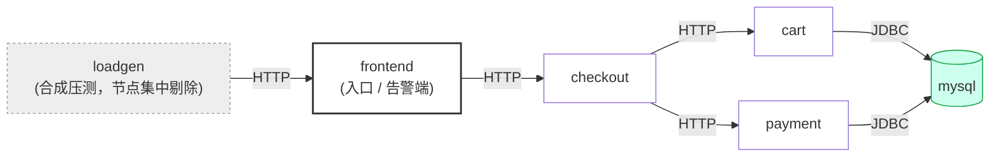
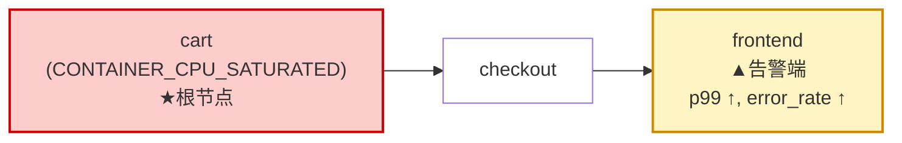
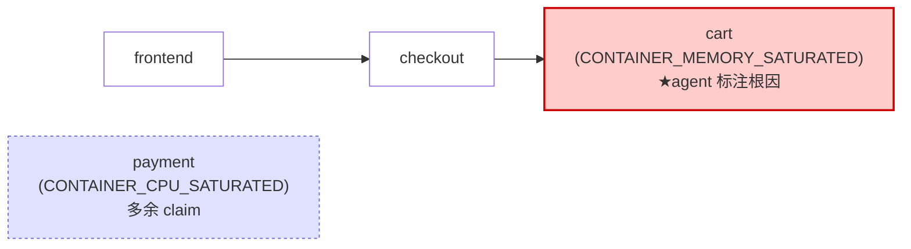
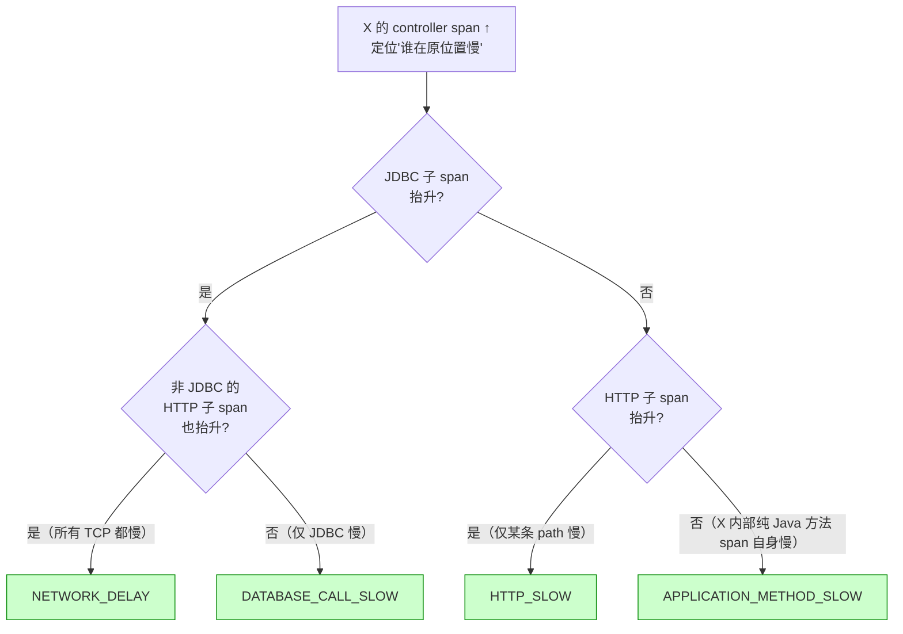

## 1. 设计原则与术语

### 1.1 唯一前提："agent 可见"

被测系统不知道自身处于评测中，也无法获取注入指令、参数、
目标的 K8s 身份。其可访问信息与真实生产 SRE 完全一致：trace、日志、指标。

### 1.2 部署运维基本概念

K8s 把"承载应用的实体"分四层包含，从下到上发出可观测信号；多个 pod 在
**稳定 DNS** 后聚合成 **service**，本评测的目标粒度即落在 service 层：


GT 内部知晓注入对象的 pod / container 身份，仅以**服务粒度**暴露给 agent：
跨服务 trace 是各微服务栈最稳定可达的观测面；pod / container 命名约定差异
巨大，要求 agent 区分会把"区分能力"退化为"识别命名约定"。

### 1.3 故障 / 症状 / 根因

四个概念按"评测方私有 → 遥测可观测面 → agent 输出"层层暴露：


文字定义：

- **注入动作（injection）**：评测方对系统施加的 chaos 操作（如 "对 cart 服务
  实施 80% CPU 限流 120s"）。agent 不可见，仅用于生成 GT。
- **故障（fault）**：注入在遥测中留下的**可观测根扰动**（如 "cart 容器持续
  CPU 受限"），agent 应当指认的对象。形式上为二元组 $(s, k)$，其中
  $s \in \text{Services}$、$k \in \text{FaultKind}$（§1.5）。故障窗口由 case
  本身的 $\omega_q$（§1.7）承载，agent **无需**单独输出。
- **症状（symptom）**：故障窗口内、相对基线的可观测偏离，位于故障的下游传播
  链上 —— 典型表现为入口侧服务的延迟 / 错误率突破 SLO 阈值（具体 SLI 字段与
  SLO 触发条件见 §1.4）。
- **根因（root cause）**：agent 对故障的最终输出，含一组根因 claim（schema
  见下表）+ 一张传播图（§1.6）。

**根因 claim schema**（按 `fault_kind` 做 discriminated union —— 共有字段
所有 RC 都填，条件字段按所选 `fault_kind` 分支决定）：

```text
RootCauseClaim {
  // ====== 共有字段（所有 RC 必填，confidence 除外）======
  service:     Service             // §1.2 service 粒度
  fault_kind:  FaultKind           // §1.5 枚举
  evidence:    [ {sql, assertion}, ... ]   // ≥1 条 DuckDB SQL + 自然语言断言
  confidence?: number ∈ [0,1]      // 可选

  // ====== 条件字段（按 fault_kind 分支必填）======
  when fault_kind ∈ NETWORK_*  →   direction_src: Service
                                   direction_dst: Service
  when fault_kind ∈ HTTP_*     →   method: "class.method"
  when fault_kind ∈ JVM_*      →   method: "class.method"
  otherwise (POD_* / 资源压力 / DNS_* / CLOCK_SKEW)  →  (无额外字段)
}
```

**字段对判分的影响**（仅前两行进 outcome layer 主指标）：

| 字段 | 是否进入主指标 | 用途 |
|---|---|---|
| `service`、`fault_kind` | ✓ outcome layer（§3.2 P / R / F1 / EM / AnySvc） | 唯一参与集合比对的字段 |
| `direction_src` / `direction_dst` | 仅辅助 service 匹配（§3.1） | NETWORK_* 时扩展 service 候选集为 `{service, src, dst}` |
| `method` | ✗ | 供人读 / 归因辅助 |
| `confidence` | ✗ | 排序参考 |
| `evidence` | 机器执行率独立计算（§3.4 SQL Exec） | 强制 agent 不只给结论；判官另行评估"是否真正支撑 claim" |

### 1.4 SLI 与 SLO

**SLI (Service Level Indicator)**：服务质量的可量化度量 —— 一段时间内"请求是否
被正确、按时处理"的统计量。典型字段：延迟分位（p95 / p99）、错误率、吞吐。

**SLO (Service Level Objective)**：基于 SLI 的目标阈值 —— 例如"frontend 的 p99
延迟在任意 5 分钟窗口内 < 300ms"。SLO 一旦违反，运维 / SRE 即认定**用户体验
受影响**了，这是值得告警的事件。

**为什么 SLO 只挂入口侧服务**（"告警端"，alarm tier）：本数据集只在 `frontend`
/ `ts-ui-dashboard` / `front-end` 这类入口服务上评估 SLO 违规，理由是只有入口
直接面向真实用户（或合成压测），下游服务（`cart` / `checkout` / `payment` 等）
的偏离要经上游聚合才能反映到用户感知。**入口侧 SLO 违规 ⇔ 用户真的受影响**，
这是把告警端定义为"用户感知边界"的依据。

若下游 SLI 偏离也独立触发告警，则一次 cart CPU stress 会让 cart / checkout /
frontend 同时被标为告警端，"告警端 = 用户感知边界"的语义就破坏了 —— PR 指标
（§2.3）也会退化为"任何下游都行"。下游 SLI 偏离仍然珍贵，但只作为**传播链上的
传导证据**用于 process layer 评分（§2.3），不独立触发告警。

**SLI 字段**。每个 episode 的 `metrics_sli.parquet` 按 (`service_name`,
`span_name`, 1 分钟时段) 聚合（自 trace 聚合而来，agent 可直接 SQL 查询）：

| 字段 | 含义 |
|---|---|
| `duration_p50` / `p90` / `p95` / `p99` | 分位延迟（ms） |
| `min_duration` / `max_duration` / `avg_duration` | 极值与均值延迟 |
| `total_count` | 当分钟该 span 总调用数（即 QPM） |
| `error_count` | 当分钟该 span 状态为 `Error` 的调用数 |

派生：`error_rate = error_count / total_count`、`qpm = total_count`。

**SLO 触发判据**由检测器维护，典型阈值：相对正常基线的 `duration_p99` 显著抬升、
`error_rate` 明显超出基线带宽。触发后该入口服务被打上"告警端"标签，进入 GT 因果
图（§1.6 的 $A^*_q$ 集合）。

### 1.5 FaultKind 词表

完整枚举如下，分 6 组：

| 组 | 枚举值 |
|---|---|
| Pod 生命周期 | `POD_FAILURE`、`POD_UNAVAILABLE` |
| 网络层 | `NETWORK_DELAY`、`NETWORK_LOSS`、`NETWORK_PARTITION`、`NETWORK_CORRUPT`、`NETWORK_DUPLICATE`、`NETWORK_BANDWIDTH_THROTTLED` |
| HTTP 应用层 | `HTTP_ABORTED`、`HTTP_SLOW`、`HTTP_RESPONSE_BODY_CORRUPTED`、`HTTP_WRONG_STATUS_CODE` |
| 资源压力 | `CONTAINER_CPU_SATURATED`、`PROCESS_CPU_SATURATED`、`CONTAINER_MEMORY_SATURATED`、`JVM_HEAP_EXHAUSTED`、`JVM_GC_THRASHING` |
| JVM 业务异常 | `APPLICATION_EXCEPTION`、`DATABASE_CALL_FAILED`、`APPLICATION_METHOD_SLOW`、`DATABASE_CALL_SLOW`、`WRONG_RETURN_VALUE` |
| 基础设施 | `DNS_LOOKUP_FAILED`、`DNS_RETURNED_WRONG_ADDRESS`、`CLOCK_SKEW` |
| 兜底 | `UNKNOWN` |

其中下列**注入动作**因观测信号等价被合并为同一类别（agent 无论采用哪一个原始
动作名都不影响判分）：

| 合并后类别 | 收敛的原始动作 | 合并理由 |
|---|---|---|
| `POD_FAILURE` | `PodKill`、`ContainerKill` | 服务表现均为短暂掉线后恢复 |
| `HTTP_ABORTED` | `HTTPRequestAbort`、`HTTPResponseAbort` | 均为连接被终止 |
| `HTTP_SLOW` | `HTTPRequestDelay`、`HTTPResponseDelay` | 均为响应延迟 |
| `HTTP_RESPONSE_BODY_CORRUPTED` | `HTTPReplacePath / Method / Body`、`HTTPPatchBody` | 均为请求负载被篡改 |
| `DNS_LOOKUP_FAILED` | `DNSError`、`DNSChaos` | 均为 DNS 解析失败 |
| `CLOCK_SKEW` | `TimeSkew`、`TimeChaos` | 同义实现 |

注入参数（强度、时长、注入到 pod 还是 container）**不进入 GT**，因为遥测亦
无法观测这些参数。

> agent 侧的「这几个名字到底怎么选」一句话辨析（含跨等价类边界规则）见
> `src/rcabench_platform/v3/sdk/evaluation/fault_kind_disambiguation.md`，
> 该文件会被 `get_agent_contract_prompt()` 自动拼到下发给 agent 的 system
> prompt。SDK 升级后老的 fault_kind 字符串通过 `FaultKind._missing_` 仍可解
> 析，历史 `eval_metrics` 不受影响。

### 1.6 因果图：节点 / 边 / 路径

**形式化定义**。一张因果图 $\mathcal{G} = (\mathcal{V}, \mathcal{E})$，其中：

- 节点 $\mathcal{V} \subseteq \text{Services}$ —— 仅服务粒度（§1.2），合成
  loadgen 类节点自动剔除；
- 边 $\mathcal{E} \subseteq \mathcal{V} \times \mathcal{V}$ —— 有向，
  $e = (u, v)$ 表示故障从 $u$ **沿传导方向**到达 $v$；
- 路径 $u \leadsto v$ —— $\mathcal{E}$ 上从 $u$ 到 $v$ 的 walk；评分时按指标
  规定取有向（§3.3 Edge F1）或无向（§3.3 PR）解释。

**评测中存在两张同型图**：GT 因果图 $\mathcal{G}^* = (\mathcal{V}^*,
\mathcal{E}^*)$ 与 agent 预测的传播图 $\hat{\mathcal{G}} = (\hat{\mathcal{V}},
\hat{\mathcal{E}})$。两者结构相同、来源不同：

|  | GT $\mathcal{G}^*$ | Agent $\hat{\mathcal{G}}$ |
|---|---|---|
| 来源 | 检测器结合注入信息 + 遥测自动构造 | agent 自行输出 |
| 性质 | 真实因果（ground truth） | 预测因果 |
| 根节点 | 故障源服务集合 $R^*$（显式标注） | agent 标注的根因服务集合 $\hat{R}$ |
| 告警端 | 入口侧 SLO 违规服务集合 $A^*$（显式，§1.4） | 不要求 |
| 每条边附证据 | — | 必须（§1.7 约束） |

**边方向语义**（两图统一）：`from = 故障起始 / 上游`，`to = 沿故障传导方向的
下游 / 更靠近用户感知端`。**禁止**使用"调用方向"（caller → callee）—— 它跟
故障影响方向通常恰好相反，会让 Edge F1 全错（PR 用无向兜底，见 §3.3）。

### 1.7 任务建模

把所有 case 的集合记为 $\mathcal{Q}$。每条 case $q \in \mathcal{Q}$ 形式化为
三元组 $q = (\mathcal{T}_q,\, \mathcal{M}_q,\, \omega_q)$：

| 符号 | 含义 |
|---|---|
| $\mathcal{T}_q$ | trace / log / metric / SLI parquet 文件集合 |
| $\mathcal{M}_q$ | 窗口元数据（命名空间、benchmark id 等） |
| $\omega_q = [t_{\text{start}}, t_{\text{end}}]$ | 故障窗口 |

**Input**（agent 可见）：$(\mathcal{T}_q,\, \mathcal{M}_q,\, \omega_q)$。
注入指令 / 参数、$R^*_q$、$A^*_q$、$\mathcal{G}^*_q$ 等 ground truth **均不
暴露**。

**Output**：

$$
\operatorname{agent}(q) \;=\; \big(\hat{R}_q,\; \hat{\mathcal{G}}_q\big)
$$

其中：

- $\hat{R}_q \subseteq \text{Services} \times \text{FaultKind}$ —— 根因
  multiset。每条 RC 仅 `(service, fault_kind)` 二元组参与判分，其余字段见
  §1.3 schema；
- $\hat{\mathcal{G}}_q = (\hat{\mathcal{V}}_q,\, \hat{\mathcal{E}}_q)$ —— 传播
  图（§1.6 定义），每条边附 SQL 证据。

**约束**：

- $|\hat{R}_q| \ge 1$；每条 RC 至少一条 SQL 证据（只读、作用域限定于
  $\mathcal{T}_q$）；
- `NETWORK_*` 必填 `direction_src/dst`；`JVM_*` / `HTTP_*` 必填 `method`；
- hybrid（多故障）case 必须输出多条 RC，禁止合并为单条；
- $\hat{\mathcal{E}}_q$ 的边方向遵循 §1.6 故障传导方向，**非**调用方向。

**评分**：对照 GT 元组 $\big(R^*_q,\, \mathcal{G}^*_q,\, A^*_q\big)$ 计算 §3
两层指标 —— outcome layer 看 $\hat{R}_q$ vs $R^*_q$，process layer 看
$\hat{\mathcal{G}}_q$ vs $\mathcal{G}^*_q$。GT 元组由注入 harness（$R^*_q$、
$A^*_q$）和检测器（$\mathcal{G}^*_q$）独立生成，且**仅暴露 agent 可见字段**：
服务名、收敛后的故障类别（§1.5）、网络方向、JVM / HTTP 方法；注入工具的原始
动作类型作为内部留痕保存，不参与评分。

### 1.8 贯穿全文的示例 case

#### 系统拓扑



此处箭头方向 = **调用方向**（caller → callee），用以说明拓扑。下面所有
"因果图 / 传播图"的箭头方向都是**故障传播方向**（与调用方向常常相反）。

#### 注入

对 `cart` 服务实施 CPU 限流 120s。注入工具的视角：`StressChaos`，
target=container，CPU=80%。但 agent 不可见此参数，仅看遥测后果。

#### GT 因果图（检测器自动构造）



- 节点集：$\mathcal{V}^*_q = \{\text{cart}, \text{checkout}, \text{frontend}\}$
  —— `payment`、`mysql` 未受影响，不入 GT 节点集；`loadgen` 作为合成压测节点
  被自动剔除。
- 边集：$\mathcal{E}^*_q = \{\text{cart}{\to}\text{checkout},\,
  \text{checkout}{\to}\text{frontend}\}$
- 根因：$R^*_q = \{(\text{cart},\, \text{CONTAINER\_CPU\_SATURATED})\}$
- 告警端：$A^*_q = \{\text{frontend}\}$

#### Agent 输出（含 4 类典型问题）



- 根因集合：$\hat{R}_q = \{(\text{cart},\, \text{CONTAINER\_MEMORY\_SATURATED}),\,
  (\text{payment},\, \text{CONTAINER\_CPU\_SATURATED})\}$
- 传播边：$\hat{\mathcal{E}}_q = \{\text{frontend}{\to}\text{checkout},\,
  \text{checkout}{\to}\text{cart}\}$（agent 误把"调用方向"当作"故障传播方向"
  输出）

这 4 类问题各自落在不同指标上，**互不传染**（§3 各方程独立计算）：

| 问题 | 影响的指标 | 不影响 |
|---|---|---|
| 服务对了（cart 出现在两侧） | AnySvc / Node F1 / fault_kind_accuracy 分母 ↑ | — |
| 类别误判（MEM ≠ CPU） | F1 / EM / fault_kind_accuracy | Node F1 / Edge F1 / PR（不看类别） |
| 多余 claim（payment） | Precision / F1 / EM | Recall / AnySvc / Node F1（多余服务进 Node 集合也只让 Node Precision 降，不影响 Recall） |
| 传播图方向反转 | **仅** Edge F1 | PR（无向兜底）、outcome layer 全部（不看图） |

§3 各项指标的计算均基于上述对照。

---

## 2. 评测指标

每个 case $q$ 一组指标，分两层报告：

- **Outcome layer**（§2.2）：把根因当作 (服务, 故障类别) 二元组的集合，做
  set-level 比对 —— 衡量"agent 给出的答案对不对"。
- **Process layer**（§2.3）：把传播图当作有向图，比对节点集 / 边集 / 路径
  可达性 —— 衡量"agent 的推理过程对不对"。

外加一项机械指标 SQL Exec（§2.4）。所有指标**相互独立**，不加权合成。
记号 $\mathcal{Q}$、$R^*_q$、$\hat{R}_q$、$\mathcal{V}^*_q$ / $\hat{\mathcal{V}}_q$、
$\mathcal{E}^*_q$ / $\hat{\mathcal{E}}_q$、$A^*_q$ 沿用 §1.7。

### 2.1 pair-level 匹配：单条 RC 何时算"对"

Outcome layer 的集合操作需要先定义 inner-RC 等价：单条 GT fault 与单条 agent
RC 比对时，三种状态：HIT / WRONG_KIND / MISS。参与判定的字段只有"服务"与
"故障类别"，`direction_src/dst`、`method`、`confidence`、`evidence` 均不参与。

```
function match(rc, gt) -> {HIT, WRONG_KIND, MISS}:
  1. 服务相等性
     candidates = NETWORK_* 时：{gt.service, gt.direction_src, gt.direction_dst}
                  其它类别：{gt.service}
     若 rc.service ∉ candidates → return MISS
  2. 类别相等性
     若 rc.fault_kind == gt.fault_kind                → return HIT
     若 rc.fault_kind 与 gt.fault_kind 落入同一等价组 → return HIT
     否则                                             → return WRONG_KIND
```

**两个等价组**（落在同一组内的类别互判等价为 HIT）：

| 等价组 | 成员 | 不区分理由 |
|---|---|---|
| Pod 不可用 | `POD_FAILURE`、`POD_UNAVAILABLE` | 差别在"是否能在窗口内恢复"，属 GT 侧知识；遥测面 agent 无稳定判据 |
| 网络阻断 | `NETWORK_LOSS`、`NETWORK_PARTITION` | 实现机制不同，但本数据集 pipeline 已剥离 Hubble drop reason / tcp flag 等关键标签（详见 §3.5） |

下文涉及 $R^*_q \cap \hat{R}_q$ 的所有集合运算均按"两元素 inner-RC 判定为
HIT 即视为相等"展开 —— 即 paper 中所谓的 **HIT-and-equivalence semantics**。
网络类双端 / HTTP 类单端的归属差异详见 §3.4。

### 2.2 Outcome layer：RC 集合上的指标

把每个 case 的 GT 与 agent 输出按"匹配 / 仅一侧出现"切成三块（以 §1.8 示例 case
为例）：


| 指标 | 定义 | 含义 |
|---|---|---|
| **Precision** | $\text{P}_q = \dfrac{\lvert\hat{R}_q \cap R^*_q\rvert}{\lvert\hat{R}_q\rvert}$ | agent 给的对了多少 |
| **Recall** | $\text{R}_q = \dfrac{\lvert\hat{R}_q \cap R^*_q\rvert}{\lvert R^*_q\rvert}$ | GT 被命中多少 |
| **F1** | $\text{F1}_q = \dfrac{2\,\text{P}_q\,\text{R}_q}{\text{P}_q + \text{R}_q}$ | P / R 的调和平均（头条指标） |
| **EM** | $\text{EM}_q = \mathbf{1}[\hat{R}_q = R^*_q]$ | 严格全等（多余 claim 也罚） |
| **AnySvc** | $\text{AnySvc}_q = \mathbf{1}[\exists\,(\hat{s},\hat{k})\in\hat{R}_q,\,(s^*,k^*)\in R^*_q:\hat{s}=s^*]$ | 至少命中一个 GT 服务（忽略类别） |
| **Service-Precision / Recall / F1 / EM** | 把 HIT 和 WRONG_KIND 都当作"服务对了"重算 P/R/F1/EM；忽略 fault_kind 是否对 | 单看「服务定位」是否到位，与 strict 同名指标分两路报告（恒有 service-* ≥ strict-*） |

报告时对 $q \in \mathcal{Q}$ 取均值（EM / AnySvc / Service-EM 是 case-level 命中率）。

**辅助 diagnostic**（默认不上头条）：
- `fault_kind_accuracy` = HIT 在"HIT + WRONG_KIND"中的占比 —— 服务对了之后
  类别还对不对，定位"服务范围识别正确但 fault_kind 误判"的情形。
- `all_service_hit` = 是否每条 GT 都至少被服务命中一次（kind-agnostic 的
  Recall=1）。

**示例 case 算分**（基于 §1.8 的 cart/checkout/frontend，
$R^*_q = \{(\text{cart, CONTAINER\_CPU\_SATURATED})\}$，
$\hat{R}_q = \{(\text{cart, CONTAINER\_MEMORY\_SATURATED}), (\text{payment, CONTAINER\_CPU\_SATURATED})\}$）：

| 指标 | 计算 | 结果 |
|---|---|---|
| Precision | $0 / 2$ | 0.00 |
| Recall | $0 / 1$ | 0.00 |
| **F1** | — | **0.00** |
| **EM** | $\hat{R}_q \neq R^*_q$ | **false** |
| **AnySvc** | cart 出现在两侧 | **true** |
| fault_kind_accuracy | $0 / (0 + 1)$ | 0.00 |
| all_service_hit | 唯一 GT cart 被命中 | true |

### 2.3 Process layer：因果图上的指标

把 §1.6 的两张图都折叠到服务粒度后做集合比对（合成 loadgen 类节点剔除）。

| 指标 | 定义 | 方向语义 |
|---|---|---|
| **Node F1** | 节点集 $\hat{\mathcal{V}}_q$ vs $\mathcal{V}^*_q$ 的 F1 | — |
| **Edge F1** | 有序对边集 $\hat{\mathcal{E}}_q$ vs $\mathcal{E}^*_q$ 的 F1 | **严格按方向** ($a{\to}b \neq b{\to}a$) |
| **PR (Path Reachability)** | $\text{PR}_q = \mathbf{1}\big[\text{AnySvc}_q \wedge \exists\,\text{path }\hat{r}\leadsto\hat{a}\text{ in }\hat{\mathcal{G}}_q,\,\hat{r}\in R^*_q,\,\hat{a}\in A^*_q\big]$ | **无向遍历** |

**关于 PR 的无向遍历**：contract 明确要求 `from = 根因`、`to = 更靠近用户
感知端`，**禁止**写成"调用方向"（§1.6），但实测大量模型仍把 `from/to` 当作
调用方向写，会让整条链方向反转。PR 用无向遍历给"虽然方向错了但因果链连通"
兜底；严格的方向比对由 Edge F1 承担。

**示例 case 算分**：

```
Node 集: GT = {cart, checkout, frontend}    agent = {cart, checkout, frontend}
        → Node F1 = 1.00

Edge 集: GT    = {cart→checkout, checkout→frontend}
         agent = {frontend→checkout, checkout→cart}   (方向全反)
        → 交集 = ∅, Edge F1 = 0.00

PR: AnySvc=true, 起点 = cart, 无向邻接 cart — checkout — frontend
    → 可达 frontend ∈ A*_q, PR = true
```

### 2.4 SQL Exec 与不可观测兜底

- **SQL Exec**：把根因 / 传播边下挂的所有 SQL 全部交给 DuckDB 在 case 目录上
  重新执行，统计返回 ≥ 1 行的比例。仅评估机械可执行性；"SQL 结果是否真正
  支撑 claim" 由判官另行评估。
- **不可观测兜底**：若注入实际未在 episode 窗口内产生任何可观测信号（GT 因果
  图为空），该 case 视为不可观测，从分母剔除并单列报告其比例。

### 2.5 示例 case 评分小结

| 指标 | 值 | 反映的问题 |
|---|---|---|
| F1 | 0.00 | (服务, 类别) pair 严格全等率 = 0 |
| EM | false | 多重集合未完整等价 |
| AnySvc | true | 至少抓到一个 GT 服务 |
| fault_kind_accuracy | 0.00 | 唯一服务命中却类别误判 |
| Node F1 | 1.00 | 服务范围识别完全正确 |
| Edge F1 | 0.00 | 边方向全反 |
| PR | true | 无向意义下连通至告警端 |
| SQL Exec | 取决证据 | 与图无关 |

同一 case 在 outcome / process 两层呈现"服务范围全对、方向全反、类别误判、
有多余 claim"的鲜明分布 —— 这正是指标解耦的目的：任一维度失分都能独立指向
具体问题。

---

## 3. 易混淆模式

§1.5 已合并掉一批"动作不同但遥测无差异"的类别，仍需 agent 自行区分的混淆
点按**症状簇**组织：

- §3.1 资源饱和：CONTAINER_CPU_SATURATED / CONTAINER_MEMORY_SATURATED；
- §3.2 延迟类（"trace duration 抬升"）：HTTP_SLOW / NETWORK_DELAY /
  APPLICATION_METHOD_SLOW / DATABASE_CALL_SLOW；
- §3.3 失败 / 异常类（"RPC 失败 / 坏数据"）：HTTP_ABORTED vs
  NETWORK_PARTITION / NETWORK_LOSS、HTTP_RESPONSE_BODY_CORRUPTED vs NETWORK_CORRUPT；
- §3.4 服务命中归属（正交于症状簇）：双端 vs 单端；
- §3.5 等价类附录：NETWORK_LOSS / NETWORK_PARTITION 推理链全记录（虽已落入
  §2.1 等价组，留作 pipeline 修复后恢复严格判定的参考）。

### 3.1 资源饱和：CONTAINER_CPU_SATURATED vs CONTAINER_MEMORY_SATURATED

**判据**：看哪个 cgroup counter 触顶 —— `container.cpu.usage` 接近 cgroup
limit → `CONTAINER_CPU_SATURATED`；`container.memory.usage / working_set` 接近 limit →
`CONTAINER_MEMORY_SATURATED`。

**是否会互相波及**：chaos-mesh `StressChaos` 跑 stress-ng，CPU 模式 `--cpu`
worker、内存模式 `--vm` worker（分配并反复访问内存页）。两者在 K8s 典型
部署（容器无 swap）下基本正交：

- MEM 不会显著抬升 CPU：`--vm` 自身 CPU 占用远不及 cgroup CPU limit；若
  内存逼近 limit，触发 OOM-kill 而非 swap thrashing，"内存压力 → swap → CPU
  抬升"的传导链不成立。
- CPU 不会抬升 MEM：`--cpu` 不持有大块内存。

边界：JVM 堆压力会附带触发 GC → CPU 抬升，但 benchmark 已把 JVM heap / GC
拆为 `JVM_HEAP_EXHAUSTED` / `JVM_GC_THRASHING` 单独类别，不与容器级
`CONTAINER_CPU_SATURATED` / `CONTAINER_MEMORY_SATURATED` 混。

### 3.2 延迟类：四种"trace duration 抬升"的归属

**为什么放在一起讨论**：四类故障的共同症状都是某些 span 的 p95/p99 抬升，
且 controller span 会被慢子调用拖慢。仅看"某 span 是否慢"无法区分，因为
延迟会沿调用链向上传导。

**为什么实际可分**：注入装在**不同层次**，"哪些子 span 在原位置慢" vs "哪些
被拖慢"形成结构性差异 —— 这是区分的根本依据。

| 类别 | 注入层 | 直接命中的 span | 影响范围 |
|---|---|---|---|
| `NETWORK_DELAY` | TC qdisc（内核网络栈，pod veth） | 该 pod 所有出/入向 TCP span | **全部 TCP** —— 不分协议（HTTP / JDBC / gRPC / 自定义） |
| `HTTP_SLOW` | tproxy + ebtables（pod sidecar，L7 解析 HTTP） | 仅 Selector 匹配的 HTTP path 的 client span | **某条 HTTP path** —— 同 callee 的其他 HTTP path 不受影响，非 HTTP 不受影响 |
| `APPLICATION_METHOD_SLOW` | byte-buddy 字节码注入（JVM 内，目标 Java 方法前后） | 该方法所在 span | **某个 Java 方法** —— 不通过 TCP，只命中该方法被调用的请求路径 |
| `DATABASE_CALL_SLOW` | byte-buddy 字节码注入（JVM 内，JDBC 驱动 wrapper） | JDBC client span | **特定 JDBC 操作** —— 仅该 JVM 进程的 JDBC 调用，其他进程对同一 DB 的访问不受影响 |

**span 树命中模式**（注入目标服务 `cart` 处理一个 inbound 请求时，4 种故障并排
对比；颜色按"在原位置慢 / 被拖慢 / 基线"区分）：


**关键观察**：controller 在 4 种故障下永远被拖慢（任一慢子调用都会传导上去），
所以 controller 本身**不**提供区分信号。**区分信号来自子 span 的命中模式** ——
即图中红 / 灰的分布。

**决策树**（从"目标服务 X 有 span 抬升"出发）：



**两条辅助验证**：

1. **同一 callee 的多条 HTTP path 是否都慢？** 全部都慢 → NETWORK_DELAY
   （TC 命中所有 TCP，不分 path）；仅一条慢 → HTTP_SLOW。
2. **X 的不同 inbound endpoint 是否都慢？** 都慢且共同途经某个内部 Java
   方法 → APPLICATION_METHOD_SLOW；仅一条 inbound 慢 → 落在该 path 链路上的
   HTTP_SLOW 或某条特定 JDBC 的 DATABASE_CALL_SLOW。

**辅助阈值**（实测 ts 单故障样本）：受影响 span 占比 ≥ 94% 几乎可断为
NETWORK_DELAY；HTTP_SLOW 实测占比恒 < 90%；JVM_*_LATENCY 占比更窄（仅命中
该方法 / 该 JDBC 调用涉及的请求）。

**边界 case**：

- 若 callee 在该 caller 视角下**仅一条 HTTP path** 在调用，HTTP_SLOW 与
  NETWORK_DELAY 在"path 多样性"上无差别 —— 退化到 JDBC 是否同步抬升这一
  单一判据。
- 若 X 是纯 DB-only 链路（无对外 HTTP 调用）→ HTTP_SLOW 物理上不存在，
  NETWORK_DELAY 与 DATABASE_CALL_SLOW 仍可由"注入位置"区分（NETWORK 影响
  所有走 X veth 的 TCP，包括非 JDBC 的；JVM_JDBC 仅 JDBC）。
- ts 实测 5 + 12 例 NETWORK_DELAY / HTTP_SLOW 全部稳定可分。

### 3.3 失败 / 异常类：HTTP_ABORTED vs NETWORK_PARTITION / NETWORK_LOSS

同样的"症状簇 + 注入层差异"逻辑：所有这些类别都在 trace 上表现为 RPC 失败
（client span error / connection reset / 0 成功完成），但注入装在不同层 →
影响范围不同。

| 类别 | 注入层 | 影响范围 |
|---|---|---|
| `NETWORK_PARTITION` | iptables DROP | 目标服务**所有**对端调用全失败（含 DB / gRPC / 其他 HTTP path） |
| `NETWORK_LOSS`（高 loss%） | tc netem 概率丢包 | 同上，全 TCP 概率性失败 + 长尾重传签名 |
| `HTTP_ABORTED` | tproxy（L7 解析 HTTP） | 仅 Selector 匹配的 HTTP path 失败，其他 path 与非 HTTP 流正常 |

**判据**（同 §3.2 的两条辅助验证）：

1. 同一 callee 的非 HTTP 流（JDBC / gRPC / 连接池心跳）受影响吗？
   受影响 → NETWORK_*；不受影响 → HTTP_ABORTED。
2. 同一 callee 的其他 HTTP path 受影响吗？
   全部受影响 → NETWORK_*；仅一条 → HTTP_ABORTED。

NETWORK_LOSS 与 NETWORK_PARTITION 之间的进一步区分见 §3.5（结论：本数据集
无稳定推理路径，已落入 §2.1 等价组）。

**HTTP_RESPONSE_BODY_CORRUPTED vs NETWORK_CORRUPT**：

| 类别 | 数据形态 | trace / log 表现 |
|---|---|---|
| `NETWORK_CORRUPT` | TCP 位翻转 → checksum 失败 → 重传 / 连接重置 | trace duration 抬升（重传延迟）+ 连接异常；应用层收到的数据如能解析则结构合法 |
| `HTTP_RESPONSE_BODY_CORRUPTED` | 应用层结构化篡改（path / method / body / status） | trace duration 通常正常；应用日志出现 parse 错误或业务校验失败 |

### 3.4 服务命中归属：双端还是单端

横切 §3.1–§3.3 的另一个维度：故障物理上涉及 caller / callee 两端时，归属
判定取决于**遥测层面是否两端都有可识别的故障证据**。

| 故障类别 | 判定 | 数据依据 |
|---|---|---|
| `NETWORK_*`（DELAY / LOSS / PARTITION / CORRUPT / DUPLICATE / BANDWIDTH_LIMIT） | **任一端命中即 HIT** —— 接受 GT 的 `service`、`direction_src`、`direction_dst` 中任意一个 | netem 规则虽装在一端（src），但延迟 / 丢包对**两端都付一次** round-trip；trace 上两端均可识别故障，无法从遥测分辨规则物理位置 |
| `HTTP_*`（ABORTED / SLOW / PAYLOAD_MODIFIED / RESPONSE_STATUS_MODIFIED） | **仅 caller 命中即 HIT**；答 callee 计 MISS | chaos-mesh HTTPChaos 的 tproxy 通过 ebtables 接管 caller pod 全部 TCP；无论 `target=Request` 还是 `target=Response`，sleep / abort / replace 全部发生在 caller pod 的 sidecar 层。callee 的 server span 始终保持基线（实测 ts 上 caller p95 ratio 30×–325×、callee ratio ≈ 1×），caller 是数据上唯一可识别的故障位置 |
| `JVM_*`（METHOD_* / JDBC_* / HEAP / GC） | **仅该 JVM 服务命中即 HIT** | byte-buddy 注入在该 JVM 进程内，故障仅在该服务的方法 / JDBC span 体现 |

**HTTP 类的常见误判**：实测 13 个 LLM 在 ts 单故障 HTTP case（59 例 / 模型）
上有 50%+ 倾向答 callee。其推理路径是"调用 X 慢 → X 服务有问题"的业务直觉，
但该直觉**与数据可观测面不一致** —— callee 在 trace 中没有任何故障证据。
当前评分对这种误判给 MISS 是有意为之，旨在惩罚"数据不支撑的外推"。

### 3.5 等价类附录：NETWORK_LOSS vs NETWORK_PARTITION 推理链

两类故障在 **chaos-mesh 实现层**就是不同机制：`partition` 走 iptables DROP
（确定性 100% 丢包），`loss` 走 tc netem（独立概率丢包）。原理上应当可分；
但本数据集的观测 pipeline 把 Hubble 的关键标签（drop reason、tcp flag）与
OTel 的 `db.client.connections.timeouts` 等指标剥离 / 未启用，**最干净的
判据从数据中消失**。下表为残余推理链记录，供 pipeline 修复后从 §2.1 等价组
移出时参考。

| 推理链 | 判据 | 实测可用域 |
|---|---|---|
| A. 命中 peer 的"完成-成功"计数 | partition → target peer **0 次成功完成**；loss 即便 96% 也应有少量成功 | **loss% ≤ 60% 时清晰**；> 80% 时残余几近消失，与 partition 同质化 |
| B. JDBC 连接级日志语义 | "Communications link failure - 0 ms ago" / SQLState `08S01` → partition；"Read timed out" / "Connection reset" → loss | **不稳定**：实测 loss 96% 一例出现 95 次 "Connection refused"，签名重叠 |
| C. trace duration 长尾形态 | partition → 60s 客户端超时聚类；loss 低% → 重传引起的散布 | **仅 loss% < 50% 时分得开**；ops-lite 11 例 loss 全部 ≥ 53%，C 链在本数据集无效 |
| D. 成功调用时间分布 | partition 全程零；loss 间歇出现，间隔近似 TCP 重传周期 | 理论可行，需先识别 target peer；级联崩使多个 peer 同时归零，识别困难 |

**适用范围**（ts 单故障 11 + 29 例）：loss% ≤ 60%（约 2 / 11）链 A 可大概率
推得对；60% < loss% ≤ 80%（约 5 / 11）链 A 模糊；loss% > 80%（约 4 / 11）+
全部 partition：**无稳定推理路径**。这是落入等价组的实证依据。
